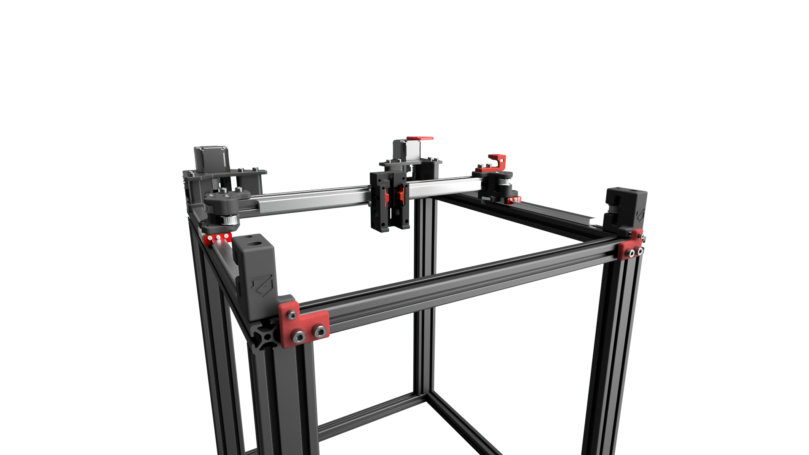
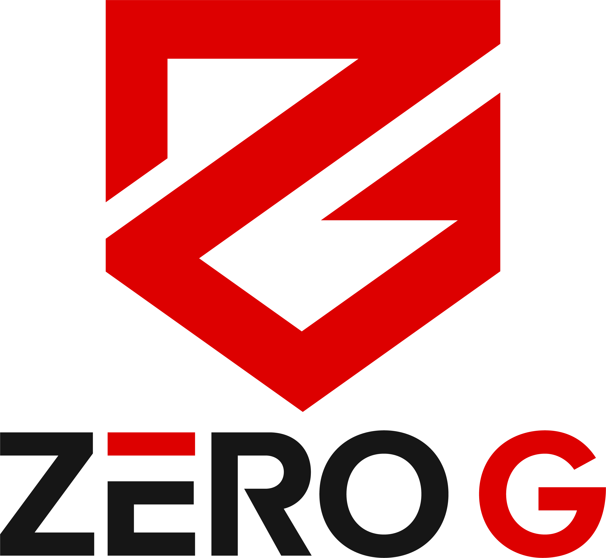

# Mercury One

 Website: https://zerogdesign.github.io/index.html
____
  
The official release Zero G Mercury One 3D printer inspired by Voron. 
This project uses a 370mm x Extrusion and 3 x 300mm MGN12H rails  
Recommended print settings: https://i.imgur.com/dN6sj4v.png
____

ZeroGDesign/Mercury is licensed under the
GNU General Public License v3.0  

